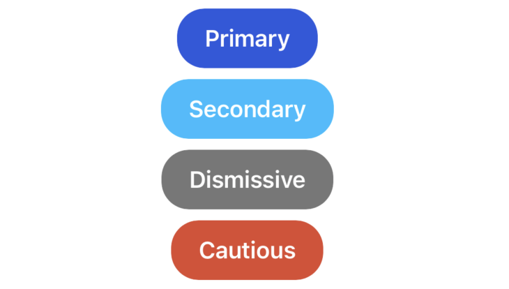
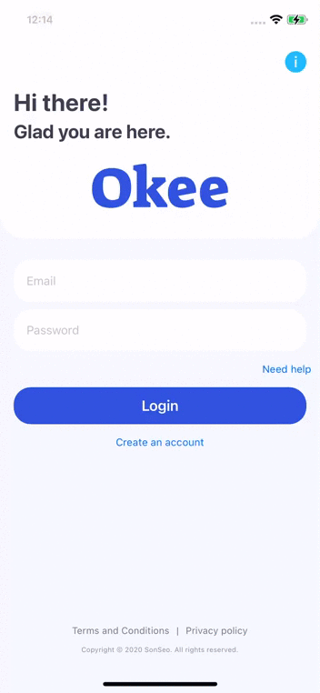
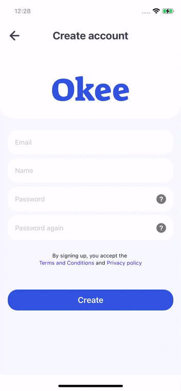

# SSUI
SSUI is an UI wrapper library that is 99% pure SwiftUI to simplify the UI setup further. The library is heavily opinionated for the sake of ease of use<br/>

The idea behind SSUI is to abstract away the details of how you customize a view's look on the coding level. As a user of SSUI, you only need to focus the declarative view's appearance config. The configs that SSUI consumes can be injected as a Decoable (so you can use json or even fetch the config from remote server) or programmatically, it's your choice.<br/>

SSUI has 2 main feature: configuring a single view's appearance and other "compound" views: alert, page slider, etc. It also provides a few common used shapes.

SSUI can support dark mode, all you need to do is supply the colors for it. If not found, it will use the light mode colors as default.

**SSUI does use a few functionalities from iOS 14, so if you're setting your project to target iOS 13, and something doesn't work, please go to my code to see if I have any check for version before report and issue**

## How to use
To install SSUI to your project, add this to your Podfile: 
```
pod SSUI
```

Some views implemented in SSUI does require you to provide some config so it knows how to config the view. If you use a custom loading indicator, `SSUIKeyboardDismissView`, `SSUITextField/SSUISecureField` (with info or clear button), or `SSUIBackableTopBar`, you'll need to implement `SSUICustomizer` and provide it to SSUI.
``` Swift
class UICustomizer: SSUICustomizer {
    ...
}

SSUI.shared.setCustomizer(UICustomizer())
```

## Single view's configuration
To customize the look of a single view, we use `SSUIViewConfig`:
``` Swift
struct MyButton {
    
    static let primary: SSUIViewConfig = createButtonConfig(withColor: MyColor.primary)
    static let secondary: SSUIViewConfig = createButtonConfig(withColor: MyColor.secondary)
    static let dismissive: SSUIViewConfig = createButtonConfig(withColor: MyColor.dismissive)
    static let cautious: SSUIViewConfig = createButtonConfig(withColor: MyColor.cautious)
    
    private static func createButtonConfig(withColor color: SSUIColor, maxWidth: Bool = false) -> SSUIViewConfig {
        let backgroundColor = color
        let foregroundColor = SSUIColor.color(light: .white)
        let corner = SSUICorners(topLeft: 20, topRight: 20, bottomRight: 20, bottomLeft: 20)
        let font = SSUIFont(systemFont: .body,  properties: [.bold])
        let frame = SSUIFrame(expandHorizontally: maxWidth, verticalPadding: 10, horizontalPadding: 20)
        return SSUIViewConfig(backgroundColor: backgroundColor, foregroundColor: foregroundColor,
                              corners: corner, font: font, frame: frame)
    }
}

struct Buttons: View {
    var body: some View {
        VStack {
            Button("Primary") {}.applySSUIConfig(MyButton.primary)
            Button("Secondary") {}.applySSUIConfig(MyButton.secondary)
            Button("Dismissive") {}.applySSUIConfig(MyButton.dismissive)
            Button("Cautious") {}.applySSUIConfig(MyButton.cautious)
        }
    }
}
```
The piece of code above will produce this, or you can go nut with it and add gradient, shadow, etc.: <br/>

<br/>
All of the config within SSUIViewConfig are pretty self-explanatory so I won't be going over them. <br/>

**Note:** SSUIColor can take String as input, but the string has to conform the format of: `[6 chars for hex color][2 chars for opacity]`

## Compound views
If you think the sysem default alert is too ugly or just simply doesn't match your app design, don't worry, SSUI has you covered.
Alert is just one of many view provided by SSUI. <br/>

These views are pretty easy to understand and use, so I'll let you firgure out yourself:  `SSUITabView`, `SSUITextButton`, `SSUIBackableTopBar`, `SSUIWebView`

### Before diving into the views
SSUI gives you a view model class that you can subclass for your view model: `SSUIViewModel`. When use compound views like loading screen, alert, or or form, I strongly advise you to use SSUIViewModel.

This class provides some basic features that you can subclass and use.
**Note:** SwiftUI has a known error of `@Published` properties in subclasses of ObservableObject doesn't work. To work around that, we need to update a dummy published properties in the superclass. Here is how it's done:
``` Swift
class YourViewModel: SSUIViewModel {
    @Published var yourProperty: YourType {
        didSet {
            didSetAPublishedProperty()
        }
    }
}
```

To make the features provided by this class work, your View struct needs to invoke them like so:<br/>
``` Swift
struct YourView: View {
    @ObservedObject var viewModel = YourViewModel()
    var body: some View {
        Text("Hello there")
            .form(isPresented: viewModel.isFormShownBinding, configs: yourFormConfigs, form: viewModel.form)
            .alert(isPresented: viewModel.isAlertShownBinding, configs: yourAlertConfigs, alert: viewModel.alert)
            .loading(isPresented: viewModel.isLoadingBinding, config: yourLoadingConfig)
    }
}
```

### SSUICoverView
This is a view that can add a layer to your view when triggered:<br/> 
**Your view | A color over your view | custom view**
This is what SSUILoadingScreen, SSUIAlerts and SSUIForm is built upon. Most of the time, you'll be using SSUIForm to display custom view, but I make this view public so if you have rare use case, you can use it.

### SSUIAlert, SSUIForm and SSUILoadingScreen
As demonstrated above, when combined these with `SSUIViewModel`, showing an alert or covering your app with a loading indicator is as simple as setting  the `alert` property of the view model or the `isLoading` property.<br/>

Alert and loading screen is pretty obvious, but what is form?<br/>
SSUIForm allows you to display any view that you want as a covert view.

Alert and form takes a set of configs (`configs: yourFormConfigs`, the configs is type of `[AnyHashable: SSUIAlertConfig]`), so you can have many types of alert or form in your app. When you create the SSUIAlert or SSUIForm, just pick a type (the `AnyHashable`) and SSUI will use the corressponding config.

Here is how I config 1 type of alert and 1 type of form in my app:<br/>


**Note:** When you use SSUIForm and make it at top or bottom, SSUI will make it ignore the safe area edges, so you'll need to pad your view accordingly. You can get the safe area top and bottom inset by using this: `SSUI.safeAreaBottomInset` or `SSUI.safeAreaTopInset`. <br/>

### SSUIKeyboardDismissView
You can wrap your view within this view to display a button above the keyboard. Clicking this button will dismiss the keyboard.<br/>


### Shapes and other stuff
SSUI does provides some basic insettable shapes like `SSUIArror`, `SSUICross`, etc.<br/>
`SSUIKeyboardResponder` is a good way to detect keyboard shown/dismissed.
There could more that I forget to mention here. Go and explore yourself :D
